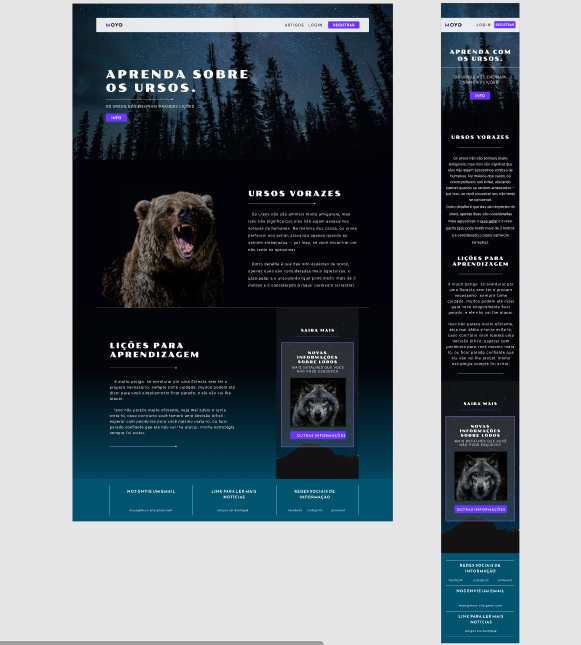
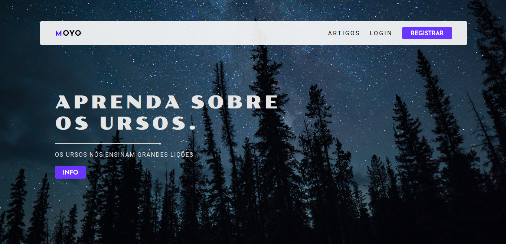

# MOYO-

> Essa é minha primeira página utilizando o Figma,

> você pode ter detalhes do meu trabalho observando a baixo:



## Objetivos:

- Desenvolver uma logo própria;
- Posicionar os elementos com técnicas de UI;
- Definir padrão para cores e fontes;
- Desenvolver a aplicação em html, css e Js;

## Considerações:

=> Todo conteúdo foi feito no Figma.

=> O código será organizado pelos padrões a baixo.

> Uma pequena amostra do resultado -->



## Tópicos adiante:

- Cores
- Fontes
- Pastas e Arquivos
- Contribuições

### Cores -->

> // VCC - Variáveis de controle de código

```
  --white:#E5E5E5;
  --white-100:#FFFFFF;
  --white-200:#FFFFFFE5;

  --purple:#6A36FF;
  --purple-100:#8a5fff;
  --purple-200:#5122d1;
  
  --black:#030208;
  --black-100:#09080ca2;
  --black-200:#000000ea;

  --ciano: #005470;
  --ciano-100: #167fa2;
  --ciano-200: #004258;
  
  --transparent: rgba(255, 255, 255, 0.12);
  --gradient: linear-gradient(180deg, rgba(0, 139, 185, 0.5) 0.01%, rgba(4, 7, 8, 0.5) 63.02%);
```

### Fontes -->

> // VCC - Variáveis de controle de código

```
  --roboto: 'Roboto';
  --poller: 'Poller One';
  --reem: 'Reem Kufi Ink';
```

> API Google Fonts =>

```
  <link rel="preconnect" href="https://fonts.googleapis.com">
  <link rel="preconnect" href="https://fonts.gstatic.com" crossorigin>
  <link href="https://fonts.googleapis.com/css2?family=Poller+One&family
  =Reem+Kufi+Ink&family=Roboto:wght@100;300;400;500;700;900&display=swap"
   rel="stylesheet">
```

### Pastas e Arquivos -->

=> Os arquivos terão localização na raíz correspondente.
> exemplo: pasta css, terá apenas arquivos css.

=> Não restrição para utilização de qualquer código, mas publicar essa página será considerada `plágio`.

=> Para `clonar` esse repositório basta usar o comando abaixo no terminal.

```
git clone https://github.com/ErickNoGit/MOYO.git
```

### Contribuição -->

=> Caso deseja contribuir de alguma forma, seja para criar novas páginas relacionadas no `figma`, ou dar manutenção no código. Basta clicar no link do meu Perfil e conversar comigo diretamente.
